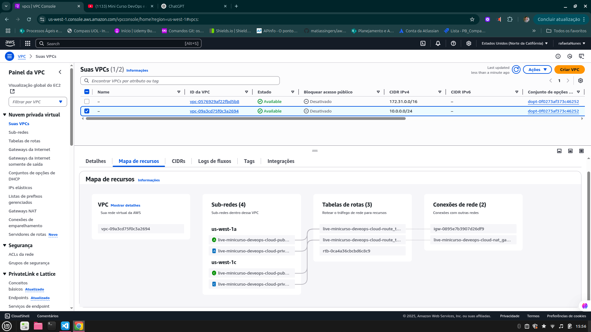

# 🧑‍💻 Mini Curso DevOps e AWS | Redes - Aula 02

🔗 [Assista à Aula no YouTube](https://www.youtube.com/watch?v=-xmrtJNodvw&t=4978s)

Este projeto demonstra a criação de uma infraestrutura básica na AWS usando Terraform, com foco em redes (subnets públicas/privadas, NAT Gateway, entre outros). A imagem ao final mostra como ficou a arquitetura criada.

---

## ✅ Pré-requisitos

Antes de rodar os códigos, é necessário:

### 1. Instalar o Terraform
- Site oficial: https://developer.hashicorp.com/terraform/downloads

### 2. Instalar a AWS CLI
- Guia de instalação: https://docs.aws.amazon.com/cli/latest/userguide/install-cliv2.html

### 3. Configurar as credenciais da AWS

#### Método 1: usando `aws configure`

```bash
aws configure
```

#### Método 2: manual com `nano`

**Arquivo de credenciais:**

```bash
nano ~/.aws/credentials
```

```ini
[default]
aws_access_key_id = SUA_ACCESS_KEY
aws_secret_access_key = SUA_SECRET_KEY
```

**Arquivo de configuração da região:**

```bash
nano ~/.aws/config
```

```ini
[default]
region = us-east-1
output = json
```

---

## 🚀 Comandos Terraform

```bash
terraform init         # Inicializa o diretório
terraform validate     # Valida os arquivos
terraform apply        # Cria a infraestrutura
terraform destroy      # Destroi todos os recursos criados
```

---

## 📁 Estrutura dos Arquivos

```
.
├── ec2.eip.tf
├── image.png                      # Mapa da infraestrutura
├── main.tf
├── outputs.tf
├── readme.md
├── terraform.tfstate              # Arquivo de estado
├── terraform.tfstate.backup
├── variables.tf
├── vpc.internet-gateway.tf
├── vpc.nat-gateway.tf
├── vpc.private-route-table.tf
├── vpc.private-subnet.tf
├── vpc.public-route-table.tf
├── vpc.public-subnet.tf
└── vpc.tf
```

---

## ☁️ Recursos Criados na AWS

| Recurso                  | Descrição                                     | Gratuito (Free Tier)?         |
|--------------------------|-----------------------------------------------|-------------------------------|
| VPC                      | Rede virtual personalizada                    | ✅ Sim                        |
| Subnets públicas         | Subdivisão da VPC com acesso externo          | ✅ Sim                        |
| Subnets privadas         | Subdivisão da VPC sem acesso externo direto   | ✅ Sim                        |
| Internet Gateway         | Permite comunicação com a internet            | ✅ Sim                        |
| NAT Gateway              | Permite que subnets privadas acessem a internet | ⚠️ **Não** (Cobrado por hora e GB de dados) |
| Route Tables             | Definições de rotas para subnets              | ✅ Sim                        |
| Elastic IP (EIP)         | IP público fixo (usado no NAT Gateway)        | ⚠️ **Não**, se não associado a instância ativa |
| EC2 (instância)          | Servidor virtual (opcional)                   | ✅ Sim (somente t2.micro ou t3.micro, até 750h/mês) |

> ⚠️ **Atenção:** NAT Gateway e Elastic IP podem gerar custos. Use com cuidado e destrua após testar usando `terraform destroy`.

---
## 🛠️ Estrutura de Rede Criada com Terraform

### VPC (Virtual Private Cloud)
- **Quantidade:** 1
- **Descrição:** Rede isolada na AWS para hospedar todos os recursos da aplicação.

### Subnets Públicas
- **Quantidade:** 2
- **Descrição:** Sub-redes com acesso direto à internet. Ideais para balanceadores de carga ou bastion hosts.

### Subnets Privadas
- **Quantidade:** 2
- **Descrição:** Sub-redes sem acesso direto à internet. Indicadas para bancos de dados ou aplicações internas.

### Tabela de Roteamento Pública
- **Quantidade:** 1
- **Descrição:** Associada às subnets públicas, direciona o tráfego para o Internet Gateway.

### Tabela de Roteamento Privada
- **Quantidade:** 1
- **Descrição:** Associada às subnets privadas, com rota para o NAT Gateway.

---

## 🌐 Acesso à Internet

### Internet Gateway (IGW)
- **Quantidade:** 1
- **Descrição:** Permite que as subnets públicas tenham comunicação com a internet.

### NAT Gateway
- **Quantidade:** 1
- **Descrição:** Permite que as subnets privadas acessem a internet sem estarem diretamente acessíveis.

### Elastic IP (EIP)
- **Quantidade:** 1
- **Descrição:** Endereço IP público fixo atribuído ao NAT Gateway.

---

## 🗺️ Mapa da Infraestrutura

Abaixo, o resultado final da arquitetura criada na AWS:



---

## 📌 Observações

- Esse projeto foi feito para fins educacionais.
- Sempre revise os recursos que você está criando para evitar cobranças desnecessárias.
- Para consultar os limites do Free Tier da AWS: https://aws.amazon.com/free/


